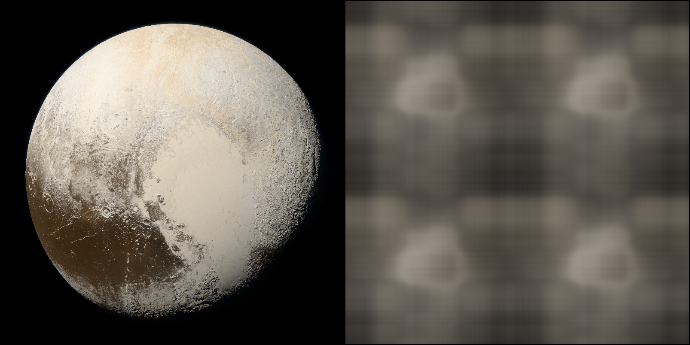
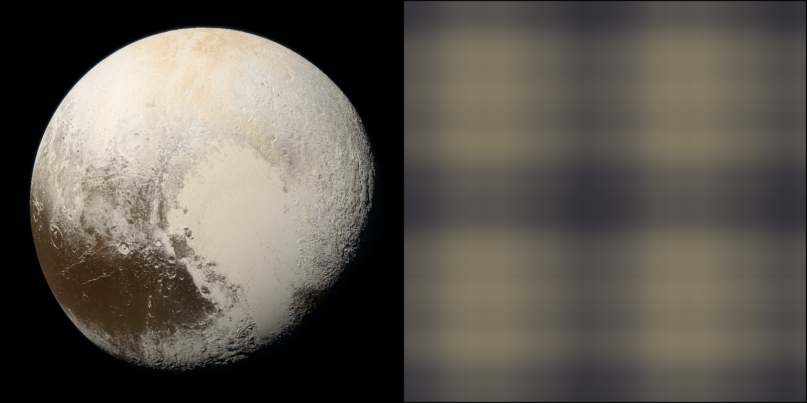
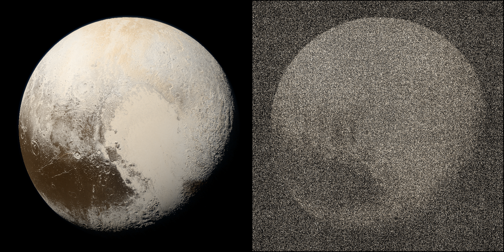
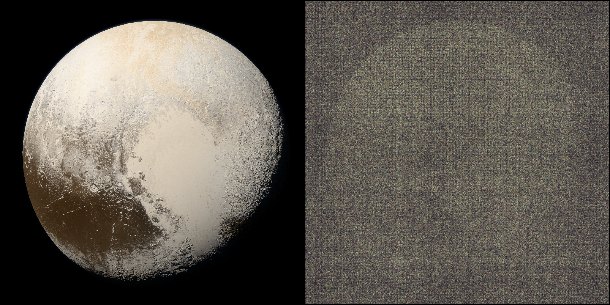
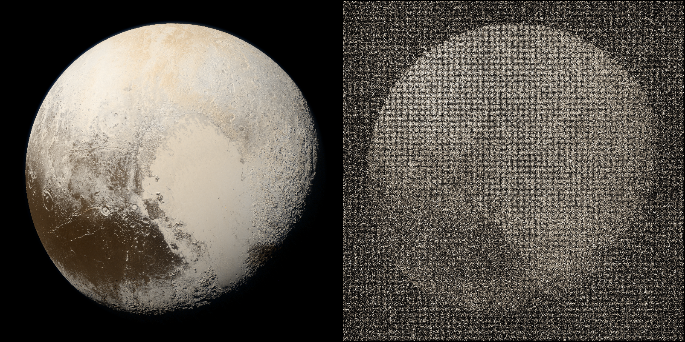
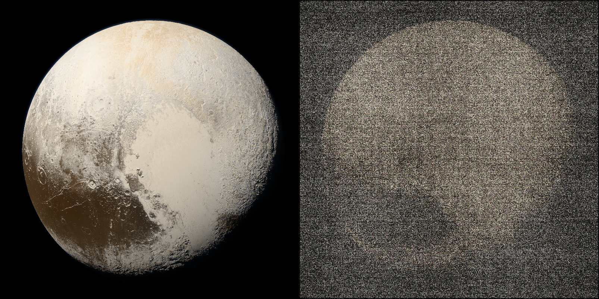
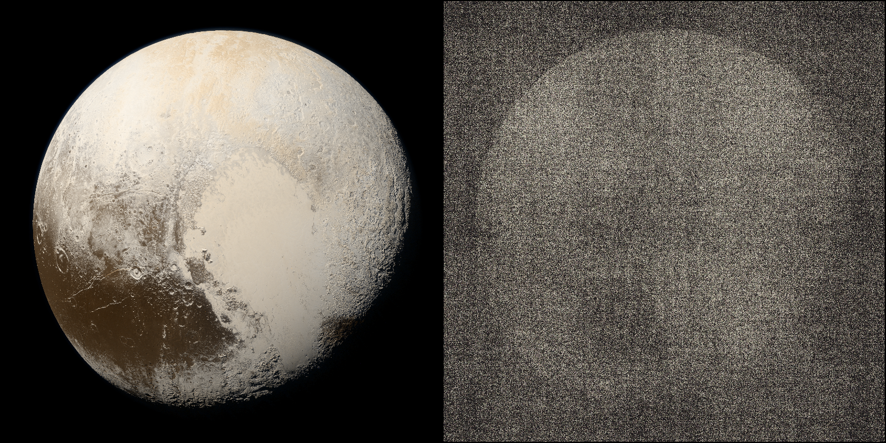

# Coordinate_based_MLPs

## Overview

Experiments of coordinate-based MLPs
``````mermaid
graph LR
	1[x]-->3[P.E.]-->4[Linear layers + activation<br>256]-->5[Linear layers + activation<br>256]-->6[Linear layers + activation<br>256]-->7[Linear layers + Sgmoid<br>256]
	2[y]-->3[P.E.]
	7-->8[R]
	7-->9[G]
	7-->10[B]
``````

|               Positional Encoding               |             Equation             |
| :---------------------------------------------: | :------------------------------: |
|             Fourier feature mapping             |           |
| Fourier feature mapping (Gaussian distribution) |  |
|                                                 |                                  |
|             **Activation function**             |           **Equation**           |
|                      ReLU                       |              |
|                      Siren                      |             |
|                    Gaussian                     |          |
|                    Quadratic                    |         |
|                 Multi Quadratic                 |  |
|                    Laplacian                    |         |
|                 Super-Gaussian                  |    |
|                     ExpSin                      |            |

## How to run

### Data preparation

- build a directory  "data/"
- make sure your own images put in "data/"
- Data used in My Experiment: **Pluto image**: [NASA](https://solarsystem.nasa.gov/resources/933/true-colors-of-pluto/?category=planets/dwarf-planets_pluto)

### Run single experiment

```python
# raw MLPs with RuLU activation function without positional encoding
python train.py --arch=relu --use_pe=False --exp_name=raw_mlps_800*800_1024
```

### Run all experiments at once

```python
# run exp with defualt setting: Image_wh=800*800 batch_size=1024
bash exp.sh
# run exp with setting: Image_wh=800*800 batch_size=800*800
bash exp_640000.sh
```

## Experiments

### ReLU  P.E.(Fourier Mapping)

#### Without Positional Encoding

|              | Image size 800*800, batch size 1024 | Image size 800\*800, batch size 800*800 |
| ------------ | :---------------------------------: | :-------------------------------------: |
|              |    |      |
| **MAX_PSNR** |               33.262                |                 21.601                  |


#### With Positional Encoding

|              | Image size 800*800, batch size 1024  | Image size 800\*800, batch size 800*800 |
| ------------ | :----------------------------------: | :-------------------------------------: |
|              |  |   |
| **MAX_PSNR** |                22.405                |                 16.957                  |

### ReLU   Fourier Mapping( Gaussian distribution)

#### 2π

|              | Image size 800*800, batch size 1024 | Image size 800\*800, batch size 800*800 |
| ------------ | :---------------------------------: | :-------------------------------------: |
|              |      |        |
| **MAX_PSNR** |               31.523                |                 24.383                  |

#### 20π

|              | Image size 800*800, batch size 1024 | Image size 800\*800, batch size 800*800 |
| ------------ | :---------------------------------: | :-------------------------------------: |
|              |     |       |
| **MAX_PSNR** |               30.004                |                 25.222                  |

#### 200π

|              | Image size 800*800, batch size 1024 | Image size 800\*800, batch size 800*800 |
| ------------ | :---------------------------------: | :-------------------------------------: |
|              |    |      |
| **MAX_PSNR** |                8.585                |                  7.146                  |

### Siren activation

As Siren dependent on quality of initialization, in this experiment I didn't initialize it specially, so the outputs are bad.

#### omega_0 = 30

|              | Image size 800*800, batch size 1024 | Image size 800\*800, batch size 800*800 |
| ------------ | :---------------------------------: | :-------------------------------------: |
|              |    |      |
| **MAX_PSNR** |                8.767                |                 22.326                  |

### Gaussian activation

#### a=0.1 with P.E.

|              | Image size 800*800, batch size 1024  | Image size 800\*800, batch size 800*800 |
| ------------ | :----------------------------------: | :-------------------------------------: |
|              |  |   |
| **MAX_PSNR** |                 8.36                 |                  8.61                   |

#### a=0.1 without P.E.

|              | Image size 800*800, batch size 1024 | Image size 800\*800, batch size 800*800 |
| ------------ | :---------------------------------: | :-------------------------------------: |
|              |    |      |
| **MAX_PSNR** |               30.677                |                 23.899                  |

### Super-Gaussian activation

#### a=0.1 b=2 with P.E.

|              |    Image size 800*800, batch size 1024     |   Image size 800\*800, batch size 800*800    |
| ------------ | :----------------------------------------: | :------------------------------------------: |
|              |  |  |
| **MAX_PSNR** |                   8.347                    |                    9.494                     |

#### a=0.1 b=2 without P.E.

|              |   Image size 800*800, batch size 1024   |  Image size 800\*800, batch size 800*800  |
| ------------ | :-------------------------------------: | :---------------------------------------: |
|              |  |  |
| **MAX_PSNR** |                 30.644                  |                  24.183                   |

### ExpSin activation

#### a=0.1 with P.E.

|              |   Image size 800*800, batch size 1024   |  Image size 800\*800, batch size 800*800  |
| ------------ | :-------------------------------------: | :---------------------------------------: |
|              |  |  |
| **MAX_PSNR** |                  9.589                  |                   9.259                   |

#### a=01 without P.E.

|              | Image size 800*800, batch size 1024  | Image size 800\*800, batch size 800*800 |
| ------------ | :----------------------------------: | :-------------------------------------: |
|              |  |   |
| **MAX_PSNR** |                24.268                |                  9.204                  |

### Laplacian activation

#### a=0.1 with P.E.

|              |    Image size 800*800, batch size 1024     |   Image size 800\*800, batch size 800*800    |
| ------------ | :----------------------------------------: | :------------------------------------------: |
|              |  |  |
| **MAX_PSNR** |                   8.273                    |                    9.268                     |

#### a=0.1 without P.E.

|              |   Image size 800*800, batch size 1024   |  Image size 800\*800, batch size 800*800  |
| ------------ | :-------------------------------------: | :---------------------------------------: |
|              |  |  |
| **MAX_PSNR** |                 31.283                  |                  24.006                   |

### Quadratic activation

#### a=10 with P.E.

|              | Image size 800*800, batch size 1024 | Image size 800\*800, batch size 800*800 |
| ------------ | :---------------------------------: | :-------------------------------------: |
|              |  |    |
| **MAX_PSNR** |                8.417                |                  8.572                  |

#### a=10 without P.E.

|              | Image size 800*800, batch size 1024 | Image size 800\*800, batch size 800*800 |
| ------------ | :---------------------------------: | :-------------------------------------: |
|              |     |       |
| **MAX_PSNR** |               31.222                |                 23.861                  |

### Multi-Quadratic activation

#### a=20 with P.E.

|              |   Image size 800*800, batch size 1024    |  Image size 800\*800, batch size 800*800   |
| ------------ | :--------------------------------------: | :----------------------------------------: |
|              |  |  |
| **MAX_PSNR** |                  8.448                   |                   8.846                    |

#### a=20 without P.E.

|              |  Image size 800*800, batch size 1024  | Image size 800\*800, batch size 800*800 |
| ------------ | :-----------------------------------: | :-------------------------------------: |
|              |  |  |
| **MAX_PSNR** |                30.355                 |                 23.944                  |

## Related papers

- [Implicit Neural Representations with Periodic Activation Functions](https://arxiv.org/pdf/2006.09661.pdf)
- [Fourier Features Let Networks Learn High Frequency Functions in Low Dimensional Domains](https://arxiv.org/abs/2006.10739.pdf)
- [Beyond Periodicity: Towards a Unifying Framework for Activations in Coordinate-MLPs](https://arxiv.org/pdf/2111.15135.pdf)
- [Gaussian Activated Neural Radiance Fields for High Fidelity Reconstruction & Pose Estimation](https://arxiv.org/pdf/2204.05735.pdf)
- [Spline Positional Encoding for Learning 3D Implicit Signed Distance Fields](https://arxiv.org/pdf/2106.01553.pdf)

## Acknowledgment

Thanks for kwea123's wonderful [live stream](https://youtu.be/cz3Tc9bNG8k) and his [repo](https://github.com/kwea123/Coordinate-MLPs)

