# Coordinate_based_MLPs

## Overview

Experiments of coordinate-based MLPs
``````mermaid
graph LR
	1[x]-->3[P.E.]-->4[Linear layers + activation<br>256]-->5[Linear layers + activation<br>256]-->6[Linear layers + activation<br>256]-->7[Linear layers + Sgmoid<br>256]
	2[y]-->3[P.E.]
	7-->8[R]
	7-->9[G]
	7-->10[B]
``````

|               Positional Encoding               |             Equation             |
| :---------------------------------------------: | :------------------------------: |
|             Fourier feature mapping             |     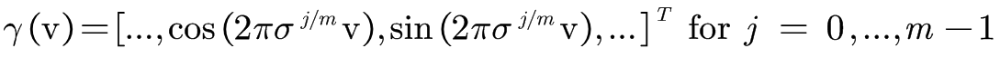      |
| Fourier feature mapping (Gaussian distribution) | 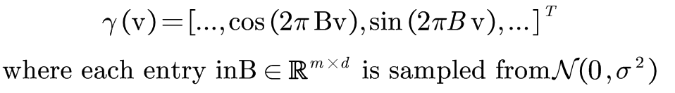 |


| Activation function |             Equation             |
| :-----------------: | :------------------------------: |
|        ReLU         |       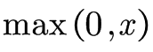       |
|        Siren        |      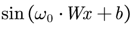       |
|      Gaussian       |     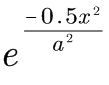     |
|      Quadratic      |    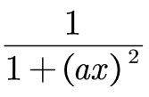     |
|   Multi Quadratic   | 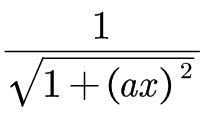 |
|      Laplacian      |    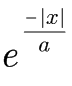     |
|   Super-Gaussian    |  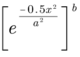  |
|       ExpSin        |      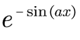      |

## Requirements

```yaml
python==3.8.12
einops==0.4.1
kornia==0.6.4
numpy==1.21.2
opencv-python==4.5.5.64
pytorch==1.11.0
pytorch-lightning==1.6.3
tqdm==4.63.0
wandb==0.12.16
```

## How to run

### Data preparation

- build a directory  "data/"
- make sure your own images put in "data/"
- Data used in My Experiment: **Pluto image**: [NASA](https://solarsystem.nasa.gov/resources/933/true-colors-of-pluto/?category=planets/dwarf-planets_pluto)

### Run single experiment

```python
# raw MLPs with RuLU activation function without positional encoding
python train.py --arch=relu --use_pe=False --exp_name=raw_mlps_800*800_1024
```

### Run all experiments at once

```python
# run exp with defualt setting: Image_wh=800*800 batch_size=1024
bash exp.sh
# run exp with setting: Image_wh=800*800 batch_size=800*800
bash exp_640000.sh
```

## Experiments

### ReLU w/o P.E.(Fourier Mapping)


#### Without Positional Encoding

| Image size 800*800, batch size 1024 | Image size 800\*800, batch size 800*800 |
| :---------------------------------: | :-------------------------------------: |
|  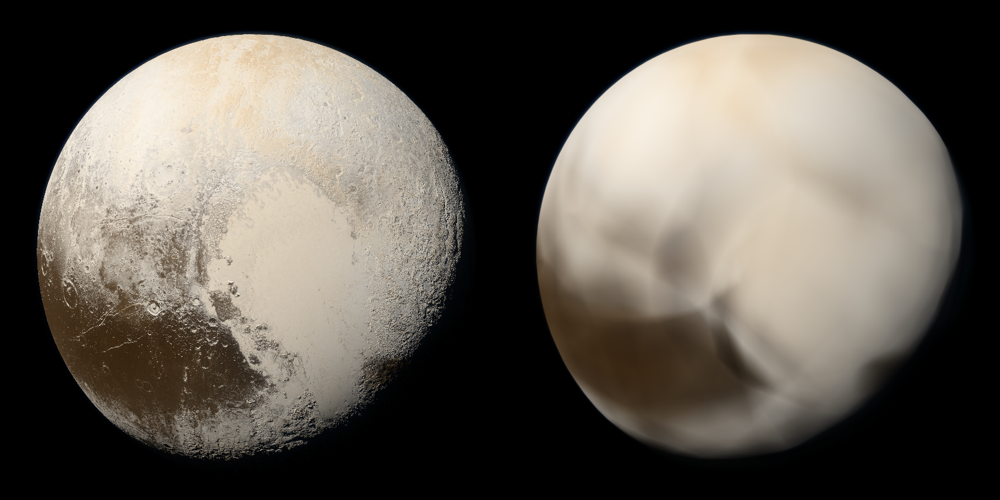  |      |

#### With Positional Encoding

| Image size 800*800, batch size 1024  | Image size 800\*800, batch size 800*800 |
| :----------------------------------: | :-------------------------------------: |
| 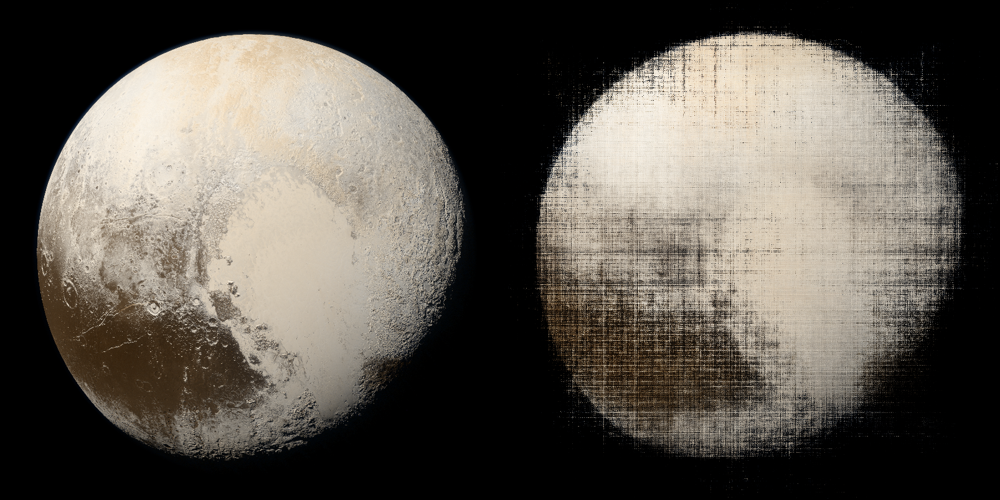 | 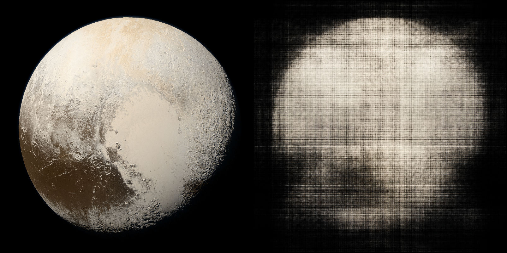  |

### ReLU with Fourier Mapping( Gaussian distribution)


#### 2π

| Image size 800*800, batch size 1024 | Image size 800\*800, batch size 800*800 |
| :---------------------------------: | :-------------------------------------: |
|      |    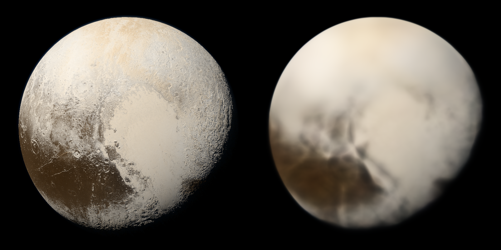    |

#### 20π

| Image size 800*800, batch size 1024 | Image size 800\*800, batch size 800*800 |
| :---------------------------------: | :-------------------------------------: |
|     |       |

#### 200π

| Image size 800*800, batch size 1024 | Image size 800\*800, batch size 800*800 |
| :---------------------------------: | :-------------------------------------: |
|  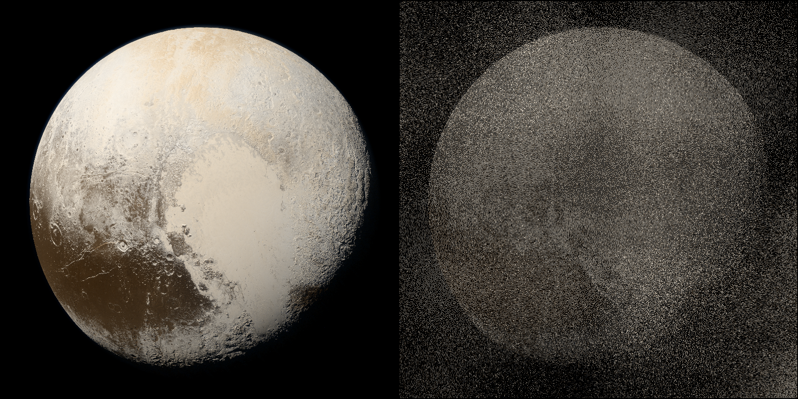  |   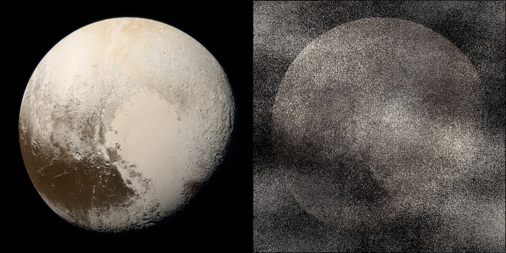   |

### Siren activation

|  |
| :-------------------: |

As Siren dependent on quality of initialization, in this experiment I didn't initialize it specially, so the outputs are bad.

#### omega_0 = 30

| Image size 800*800, batch size 1024 | Image size 800\*800, batch size 800*800 |
| :---------------------------------: | :-------------------------------------: |
|  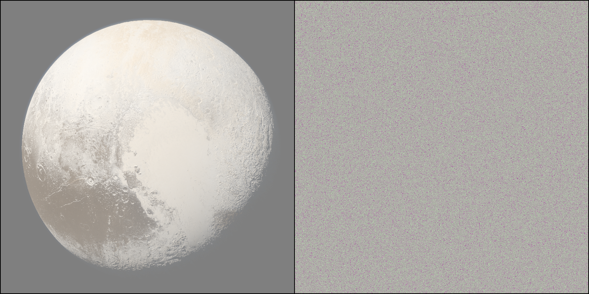  |   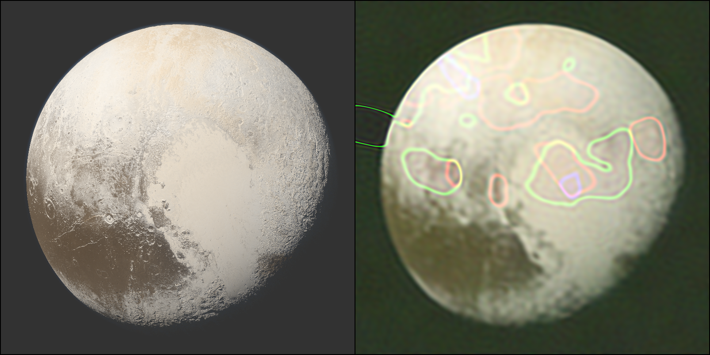   |

### Gaussian activation


#### a=0.1 with P.E.

| Image size 800*800, batch size 1024  | Image size 800\*800, batch size 800*800 |
| :----------------------------------: | :-------------------------------------: |
|  | 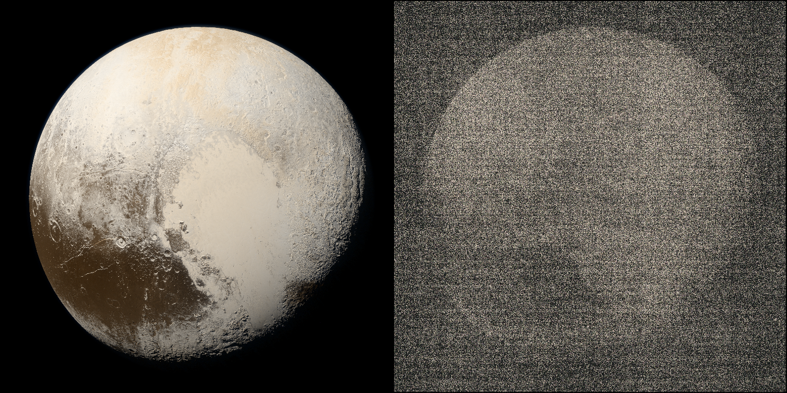  |

#### a=0.1 without P.E.

| Image size 800*800, batch size 1024 | Image size 800\*800, batch size 800*800 |
| :---------------------------------: | :-------------------------------------: |
|    |      |

### Super-Gaussian activation


#### a=0.1 b=2 with P.E.

|    Image size 800*800, batch size 1024     |   Image size 800\*800, batch size 800*800    |
| :----------------------------------------: | :------------------------------------------: |
| 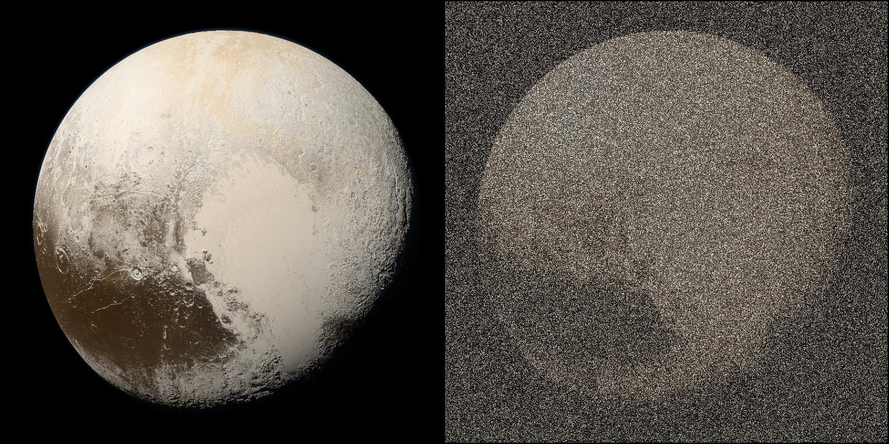 | 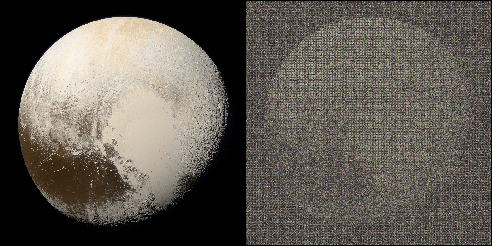 |

#### a=0.1 b=2 without P.E.

|   Image size 800*800, batch size 1024   |  Image size 800\*800, batch size 800*800  |
| :-------------------------------------: | :---------------------------------------: |
|  | 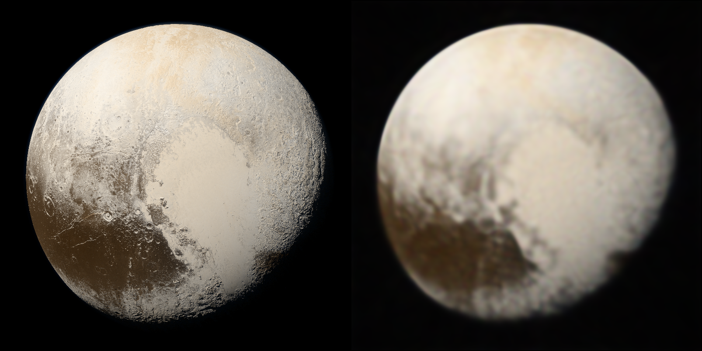 |

